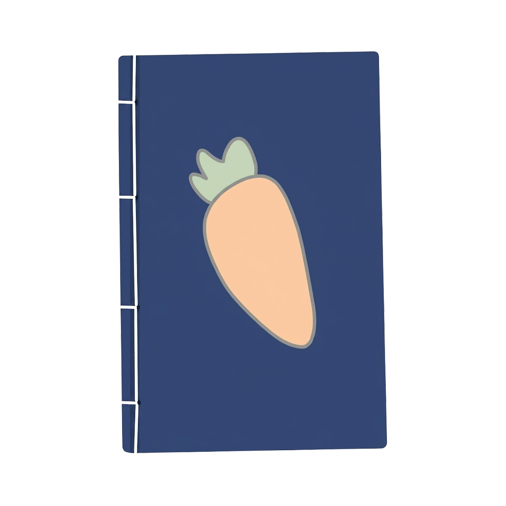

<div align="center">

<a href="#">
    
</a>

<br>

**[Usagi](https://github.com/UsagiApp/Usagi) is a free and open-source manga reader for Android, inspired by [Kotatsu](https://github.com/UsagiApp/Usagi)**

  [](https://hosted.weblate.org/engage/usagi/) [](https://discord.gg/4AHskjwtj4) [](https://t.me/usagiapp)

### Download

<table>
  <thead>
    <tr>
      <th align="center">GitHub</th>
      <th align="center">F-Droid</th>
    </tr>
  </thead>
  <tbody>
    <tr>
      <td align="center">
        <a href="https://github.com/UsagiApp/Usagi/releases/latest/">
          
        </a>
      </td>
      <td align="center">
        <a href="https://f-droid.org/en/packages/org.draken.usagi/">
          
        </a>
      </td>
    </tr>
  </tbody>
</table>

### Features

<details>
  <summary>Usagi's unique features</summary>

<div align="left">

#### All features from Usagi, include:

* Bypass internet firewalls with tunnels built into the app, expanding access to more content.
* Integrate more new user interface styles (Modern, Classic, etc.)
* Improve the ability to customize / read offline / downloaded manga.
* The accompanying services are regularly updated (Sync server / client, bot, proxy, etc.)
* Optimized for low-end devices / phones, continue to maintain / support for Android 5.0+
* Providing access to content with external plugins / extensions.
* Provides bug fixes for features that previously existed in Kotatsu.
* Provides more options to customize the user interface (style, background, etc.).

</div>
</details>

<details>
  <summary>Main features from Kotatsu</summary>

<div align="left">

#### All features from Kotatsu (original application), include:

* Search manga by name, genres and more filters
* Favorites organized by user-defined categories
* Reading history, bookmarks and incognito mode support
* Download manga and read it offline. Third-party CBZ archives are also supported
* Clean and convenient Material You UI, optimized for phones, tablets and desktop
* Standard and Webtoon-optimized customizable reader, gesture support on reading interface
* Notifications about new chapters with updates feed, manga recommendations (with filters)
* Integration with manga tracking services: Shikimori, AniList, MyAnimeList, Kitsu
* Password / fingerprint-protected access to the app
* Automatically sync app data with other devices on the same account
* Support for older devices running Android 6.0+

</div>
</details>

### In-App Screenshots

<div align="center">
    
    
    
    
    
    
</div>

<br>

<div align="center">
    
    
</div>

### Contributing

<details>
  <summary>Application / Library Development</summary>

  <br>
  
  **This project includes 2 main repositories. [This repository](#) contains the entire source code of the main application, [core-exts](https://github.com/UsagiApp/core-exts) is the repository containing all the classes compatible with external plugins / extensions for Usagi.**

  <br>

  <a href="https://github.com/UsagiApp/Usagi">
    <picture>
      <source srcset="https://github-readme-stats-fast.vercel.app/api/pin/?username=UsagiApp&repo=Usagi&theme=github_dark" media="(prefers-color-scheme: dark)">
      
    </picture>
  </a>
  <a href="https://github.com/UsagiApp/core-exts">
    <picture>
      <source srcset="https://github-readme-stats-fast.vercel.app/api/pin/?username=UsagiApp&repo=core-exts&theme=github_dark" media="(prefers-color-scheme: dark)">
      
    </picture>
  </a>
  
  <br></br>

  **📌 Pull requests are welcome, if you want:
  See [CONTRIBUTING.md](https://github.com/UsagiApp/Usagi/blob/devel/CONTRIBUTING.md) for the guidelines**

</details>

<details>
  <summary>Translate this app</summary>

  <br></br>
  <a href="https://hosted.weblate.org/engage/usagi/">
    
  </a>
  
  **📌 If you would like to help improve these or add new languages,
please head over to the [Weblate project page](https://hosted.weblate.org/engage/usagi/)**

</details>

### Certificate fingerprints

<div align="left">

```plaintext
01:B7:3E:12:A4:A8:C1:41:DB:4B:6C:0A:BE:17:A8:D3:5B:C7:DD:3A
```

```plaintext
4C:0B:D9:18:88:36:B7:27:9D:CF:91:12:3A:C9:9D:C4:F5:4F:E2:21:FB:66:FB:92:03:80:3D:16:7E:06:6F:C9
```

</div>

### License

[](http://www.gnu.org/licenses/gpl-3.0.en.html)

<div align="left">

All programs from Yumemi™ project are free, open-source programs under the GPL license. You may copy, distribute, and modify the software as long as you keep track of changes/dates in the source files. Any modifications to the software, including code licensed under the GPL (via a compiler), must also be provided under the GPL license.

</div>

### Disclaimer

<div align="left">

The developer(s) of this application does not have any affiliation with the content providers available. If there is any content, it's provided by external libraries (added / imported by users); Usagi itself doesn't include any built-in content.

</div>
